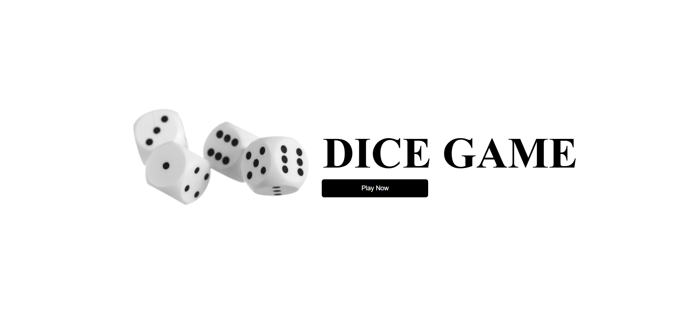
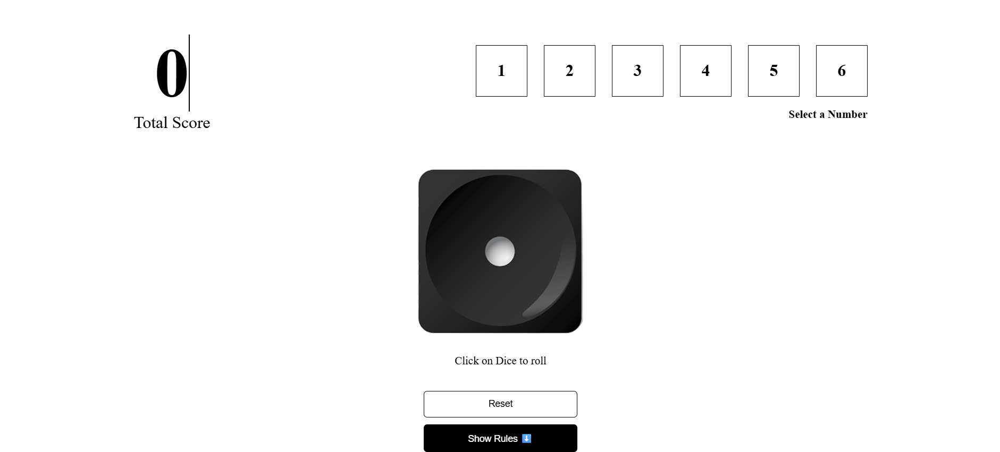

# 🎲 Dice Game

A fun and interactive dice game built using **ReactJS**. It includes a starting page and a complete gameplay experience with rules, score tracking, and a cool dice roll animation.

---

## 🚀 Pages & Components

### 🟢 1. Start Game Page

- Displays a welcome message and game title
- Includes a **"Play Game"** button
- Clicking the button navigates to the main **GamePlay** screen

### 🎮 2. GamePlay Page

This is the main screen where the game is played. It includes the following components:

#### 🎯 SelectNumber Component
- Lets player select a number between 1 to 6

#### 🎲 Dice Component
- Displays a dice image
- Clicking the dice generates a **random number between 1 to 6**
- The dice image updates based on the rolled number

#### 🧮 TotalScore Component
- Displays the current score
- If **selected number === rolled dice number**, that number is added to total score
- Else, **-2 points** are deducted

#### 🔁 Reset Score Button
- Resets the total score to 0

#### 📜 Show Rules Button
- Toggles the **Rules component** which explains how the game works

---

## 🧠 Game Rules

1. Select a number between 1 to 6.
2. Click the dice to roll.
3. If your selected number matches the dice roll, your selected number is added to the score.
4. If it doesn’t match, 2 points are deducted.
5. Click **Reset Score** to start over.
6. You can toggle the rules anytime using the **Show Rules** button.

---

## 🛠️ Tech Stack

- ⚛️ ReactJS (Functional Components)
- 🎨 CSS (for styling)
- 🧠 useState Hook for state management

---

## 📁 Folder Structure

```bash
📦 DiceGame
├── public/
├── src/
│   ├── components/
│   │   ├── TotalScore.jsx
│   │   ├── SelectNumber.jsx
│   │   ├── Rules.jsx
│   │   └── Dice.jsx
│   ├── pages/
│   │   ├── StartGame.jsx
│   │   └── GamePlay.jsx
│   ├── App.jsx
│   └── index.js
├── package.json
└── README.md

## 📸 Screenshots

### 🟢 Start Game Page


### 🎮 GamePlay Page



🌐 Live Demo
🔗 Click Here to Play


👨‍💻 Author
Made by Rudraksh Tyagi.

